<div align="center">

<p align="center">
  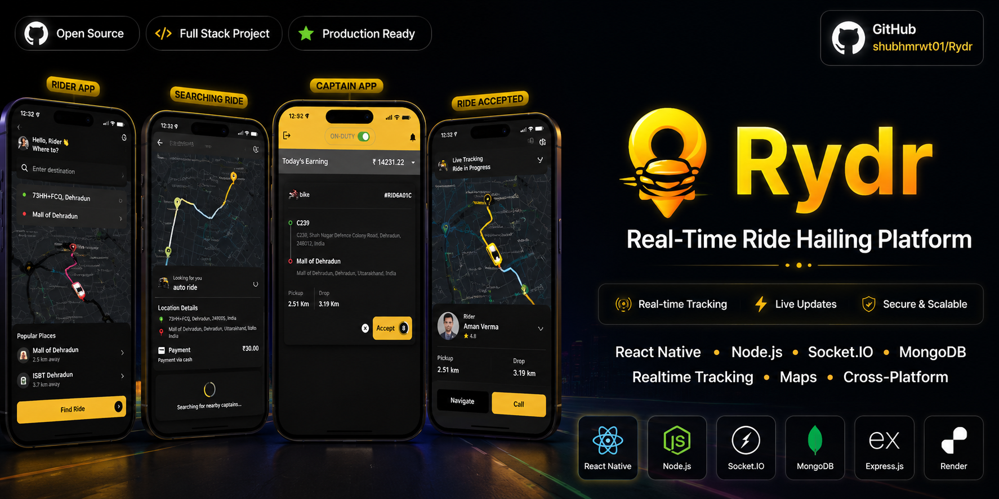
</p>
<h1>🚘 Rydr</h1>

<p><em>Ride Smart. Ride Fast.</em></p>

<p>A real-time ride booking app where customers book rides on a live map<br/>and riders receive instant ride requests.</p>


---

[](https://github.com/shubhmrwt01/Rydr/releases/tag/Rydr)
&nbsp;
[](https://github.com/shubhmrwt01/Rydr/issues)
&nbsp;
[](https://github.com/shubhmrwt01/Rydr/issues)

</div>

## Features

|     |                                                                              |
| :-: | ---------------------------------------------------------------------------- |
| ✅  | Separate Customer and Rider experiences                                      |
| ✅  | Real-time ride matching and live status updates via Socket.IO                |
| ✅  | Live GPS streaming — rider position broadcast to customer map                |
| ✅  | Secure authentication with access and refresh tokens                         |
| ✅  | Smart fare calculation using geo-location utilities                          |
| ✅  | End-to-end ride lifecycle: Create → Offer → Accept → In Progress → Completed |

---

## 🛠️ Tech Stack

### 🖥️ Frontend &nbsp;·&nbsp; `client/`

| Tech                                                                                                              | Purpose                  |
| :---------------------------------------------------------------------------------------------------------------- | :----------------------- |
|    | Cross-platform mobile UI |
|    | Static typing & safety   |
|        | File-based navigation    |
|                   | HTTP client              |
|  | Live maps & location     |

---

### ⚙️ Backend &nbsp;·&nbsp; `server/`

| Tech                                                                                                           | Purpose            |
| :------------------------------------------------------------------------------------------------------------- | :----------------- |
|        | JS runtime         |
|    | REST API framework |
|  | Real-time events   |
|            | Stateless auth     |

---

### 🚀 Infrastructure

| Tech                                                                                                               | Purpose              |
| :----------------------------------------------------------------------------------------------------------------- | :------------------- |
|                 | Backend hosting      |
|               | Build & OTA delivery |
|  | Cloud database       |

---

## Project Structure

```
Rydr/
├── client/               # React Native · Expo · TypeScript
│   ├── src/              # Screens, components, context, services
│   ├── android/ & ios/   # Native projects
│   └── app.config.js
│
├── server/               # Express · Socket.io
│   ├── controllers/      # Auth & ride logic
│   ├── models/           # User, Ride (Mongoose)
│   ├── routes/           # /auth  /ride
│   ├── utils/            # mapUtils — geo & fare
│   ├── errors/           # Error classes + middleware
│   ├── sockets.js        # All Socket.io event handlers
│   └── app.js
│
└── docs/
    └── architecture.png
```

---

## Architecture

<div align="center">
  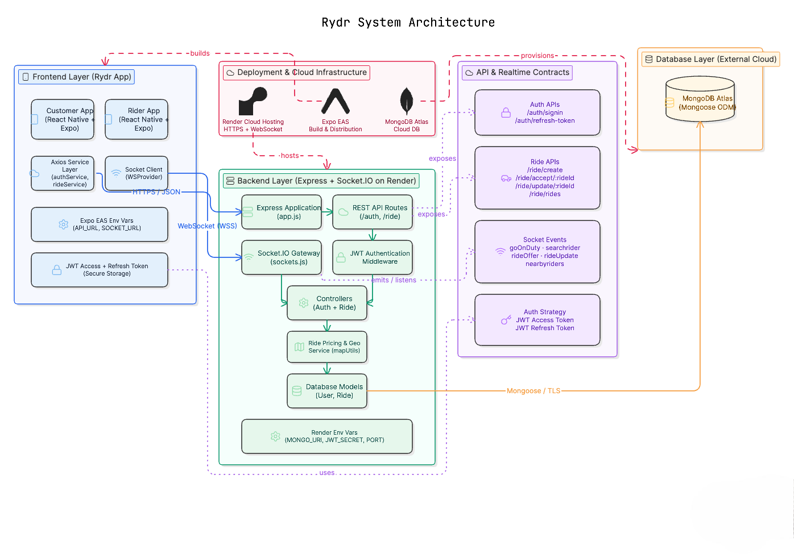
</div>

---

## 🎥 Real-Time Ride Lifecycle Demo

<div align="center">

### 📱 Customer App ↔ 🏍️ Rider App

https://github.com/user-attachments/assets/ae40e496-4a72-4db9-ab44-a6ba618c1dc4

</div>

### 🔄 End-to-End Ride Flow

1. Customer selects pickup & destination
2. Ride request is broadcast in real time via Socket.IO
3. Rider instantly receives the request
4. Rider accepts the ride
5. Live GPS tracking updates both devices
6. OTP verification before trip start
7. Ride progresses with real-time status updates
8. Ride successfully completed

### ✨ Highlights

- Real-time bidirectional communication using Socket.IO
- Live rider location streaming
- Separate Customer and Rider applications
- Secure JWT authentication
- Complete ride lifecycle management

---

## 📱 Screenshots

### 🚀 Onboarding

<div align="center">

|                        Splash                        |                        Role Selection                        |
| :--------------------------------------------------: | :----------------------------------------------------------: |
| 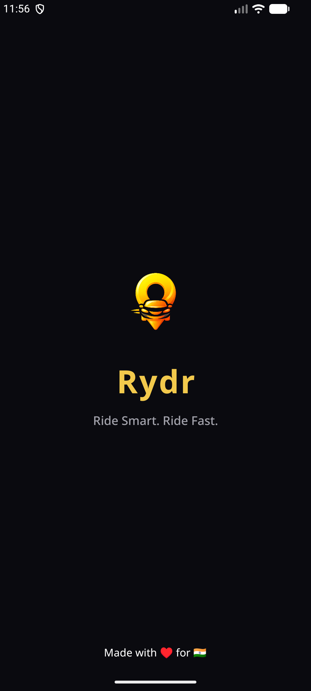 | 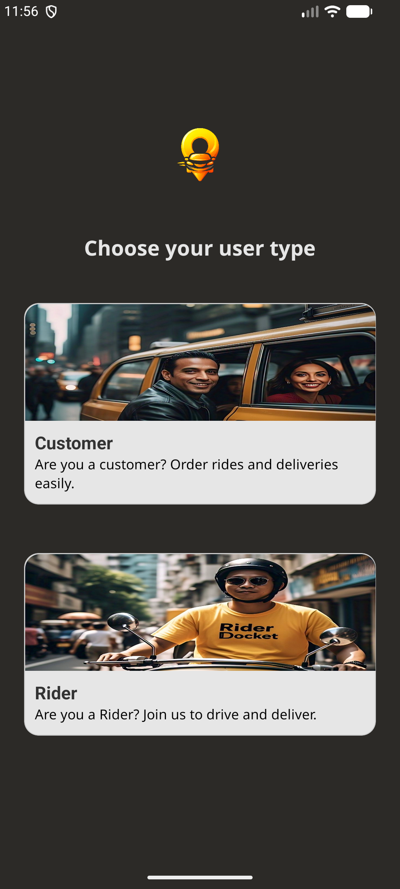 |

</div>

---

### 👤 Customer Flow

<div align="center">

|                          Login                          |                            Home                             |                              Search                              |                        Ride Options                        |
| :-----------------------------------------------------: | :---------------------------------------------------------: | :--------------------------------------------------------------: | :--------------------------------------------------------: |
| 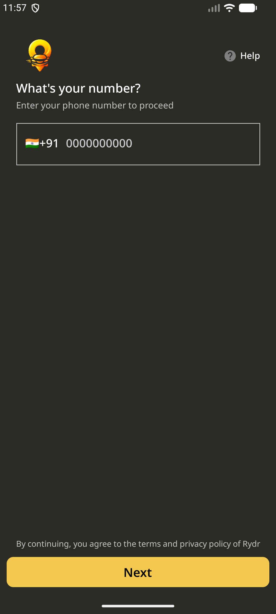 | 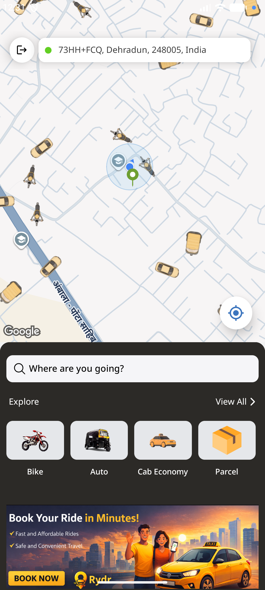 | 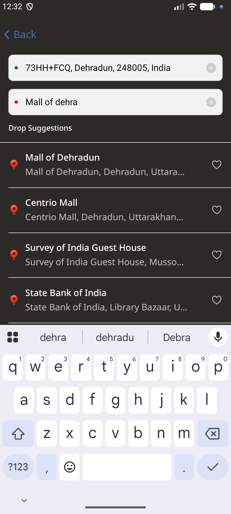 | 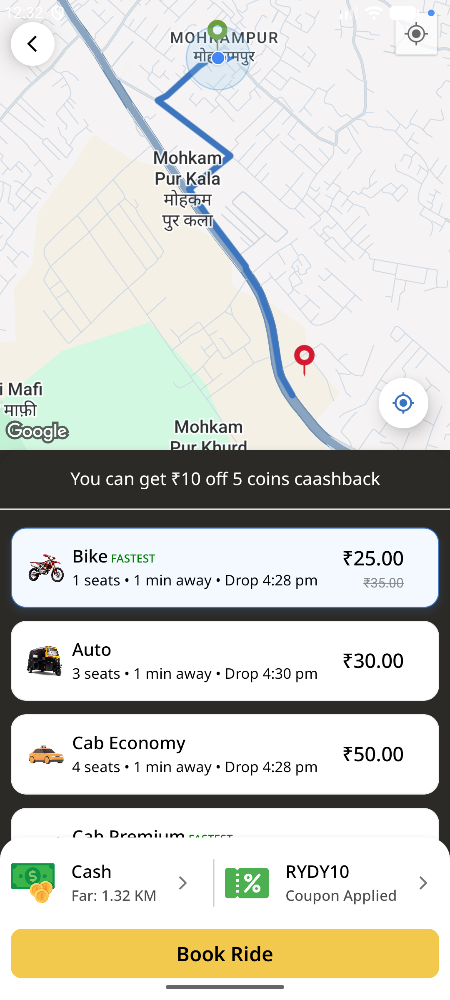 |

|                         Finding Rider                         |                       OTP Verify                       |                        Ride Completed                        |
| :-----------------------------------------------------------: | :----------------------------------------------------: | :----------------------------------------------------------: |
| 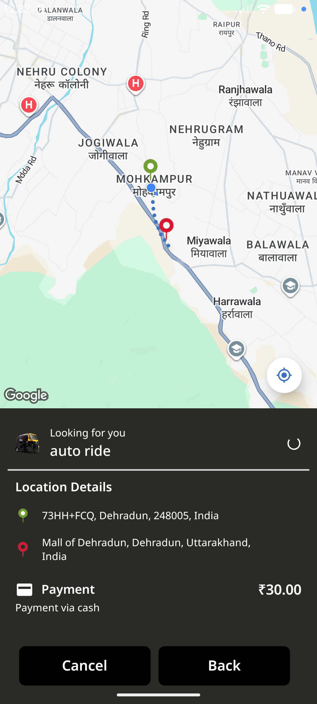 | 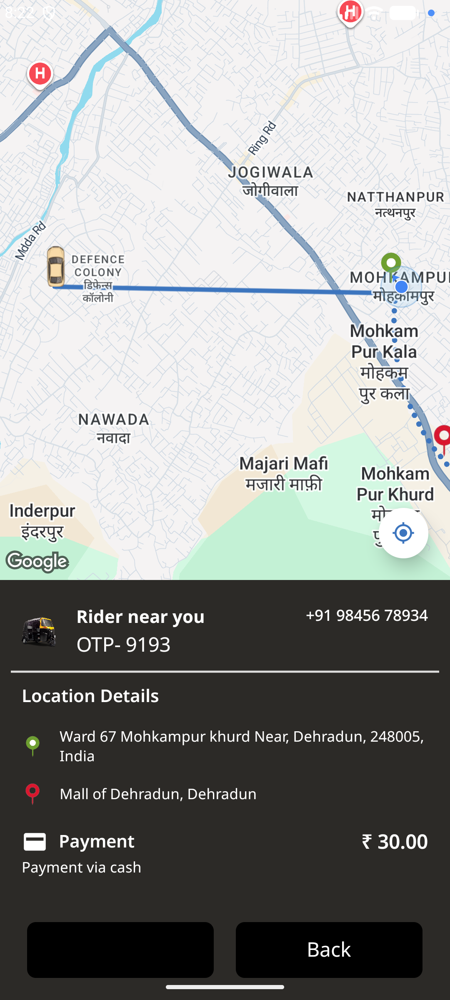 | 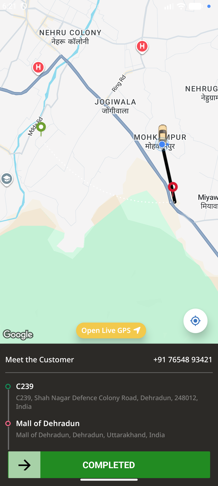 |

</div>

---

### 🏍️ Rider Flow

<div align="center">

|                          Login                           |                        Ride Request                         |                           OTP Verify                           |                           Navigation                           |                          Off Duty                           |
| :------------------------------------------------------: | :---------------------------------------------------------: | :------------------------------------------------------------: | :------------------------------------------------------------: | :---------------------------------------------------------: |
| 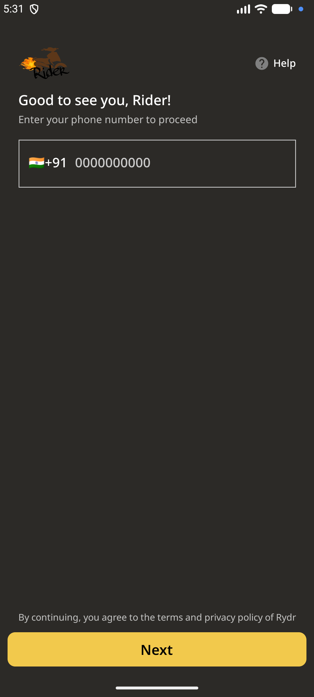 | 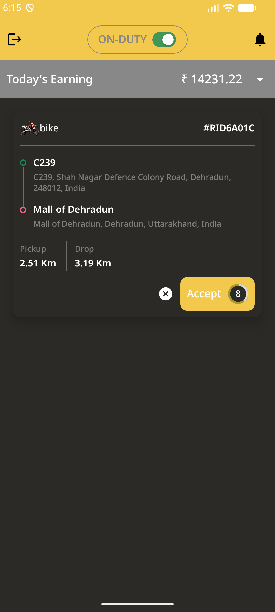 | 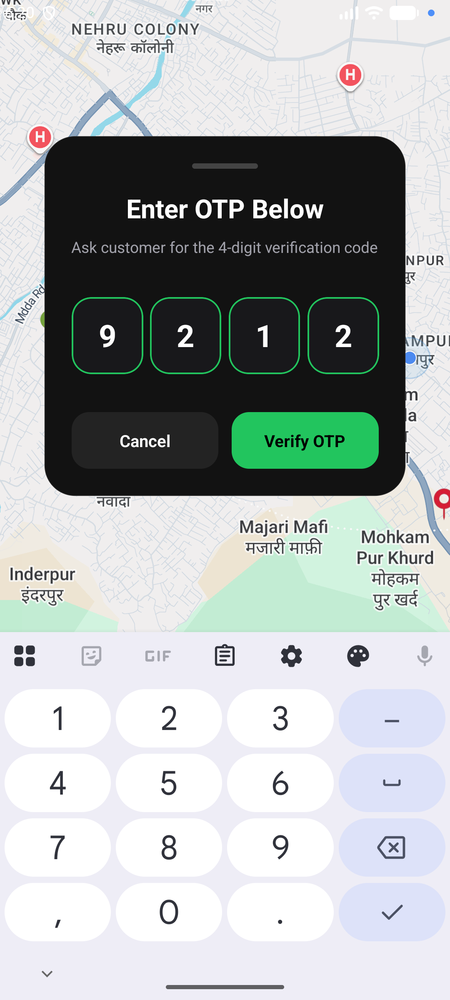 | 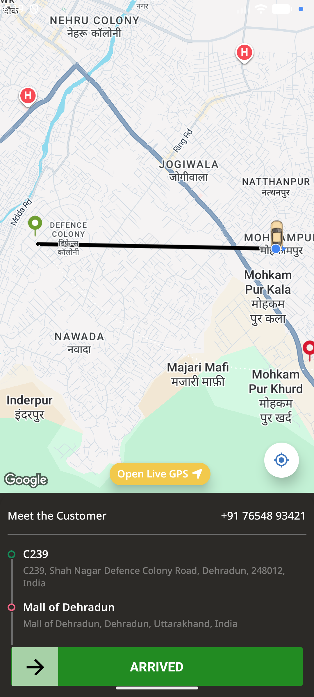 | 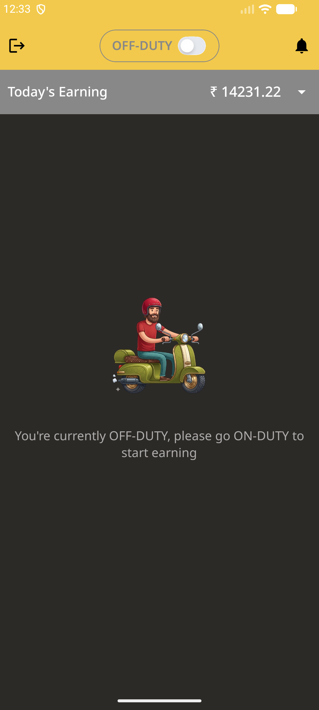 |

</div>

---

## Development & Deployment

**Prerequisites:** Node.js ≥ 20, MongoDB Atlas, Expo Go, Android emulator, or a physical device

### 1) Clone the repository

```bash
git clone https://github.com/shubhmrwt01/Rydr.git
cd Rydr
```

### 2) Backend setup

For local development:

```bash
cd server
cp ".env-template copy" .env
npm install
npm start
```

For production, the backend is deployed on Render:

- **Backend URL:** [https://rydr-o2d5.onrender.com](https://rydr-o2d5.onrender.com)

> Note: Render free services may sleep after inactivity. Opening the backend URL once will wake the server before using the app.

### 3) Frontend setup

For local development:

```bash
cd client
npm install
npx expo start
```

For production builds, the frontend is distributed using Expo EAS.
Set the following environment variables in your EAS project:

```env
EXPO_PUBLIC_BASE_URL=https://rydr-o2d5.onrender.com
EXPO_PUBLIC_SOCKET_URL=https://rydr-o2d5.onrender.com
```

### 📦 Download App

> [!NOTE]
> **Backend runs on Render's free tier** — if the app feels slow on first launch, [wake the server](https://rydr-o2d5.onrender.com) first and wait ~30 seconds.

<div align="center">

[](https://github.com/shubhmrwt01/Rydr/releases/tag/Rydr)
&nbsp;&nbsp;
[](https://rydr-o2d5.onrender.com)

</div>

---

## 🚀 Future Enhancements

| Feature            | Description                                                           |
| ------------------ | --------------------------------------------------------------------- |
| 🤖 AI Assistant    | Conversational support for bookings, ride queries, and real-time help |
| ⏱️ Predictive ETA  | Smarter estimates powered by live traffic and historical trip data    |
| 💳 In-App Payments | Secure checkout via Stripe and Razorpay with saved cards and UPI      |
| 🎙️ Voice Controls  | Hands-free ride booking and navigation using voice commands           |
| 🗺️ Smart Routing   | Routes that adapt in real time to traffic and road closures           |

---

## 🤝 Contributing

We love contributions! Here's how you can help:

1. **Fork** the repository
2. **Create** a feature branch (`git checkout -b feature/AmazingFeature`)
3. **Commit** your changes (`git commit -m 'Add some AmazingFeature'`)
4. **Push** to the branch (`git push origin feature/AmazingFeature`)
5. **Open** a Pull Request

## 🐛 Found a Bug?

If you find a bug or have a feature request, please [open an issue](https://github.com/shubhmrwt01/Rydr/issues) with:

- Clear description
- Steps to reproduce
- Expected vs actual behavior
- Screenshots (if applicable)

---

## 📄 License

This project is licensed under the **MIT License** - see the [LICENSE](LICENSE) file for details.

---

## 👨‍💻 Author

<div align="center">

**Shubham Rawat**

[](https://github.com/shubhmrwt01)
[](https://linkedin.com/in/shubhmrwt01)

</div>

---

<div align="center">

### ⭐ Star this repo if you find it helpful!

**Made with ❤️ to book your ride**

_© 2026 Shubham Rawat. All rights reserved._

</div>
